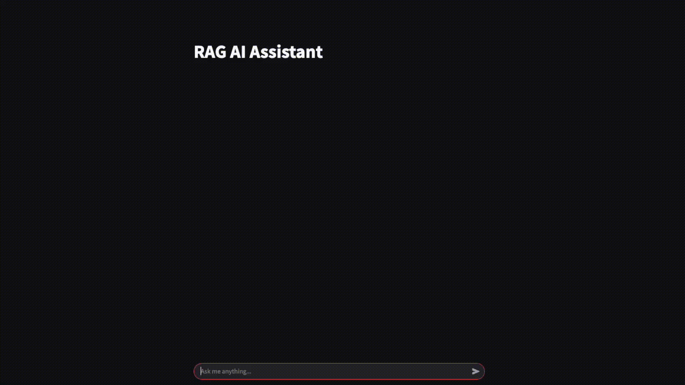
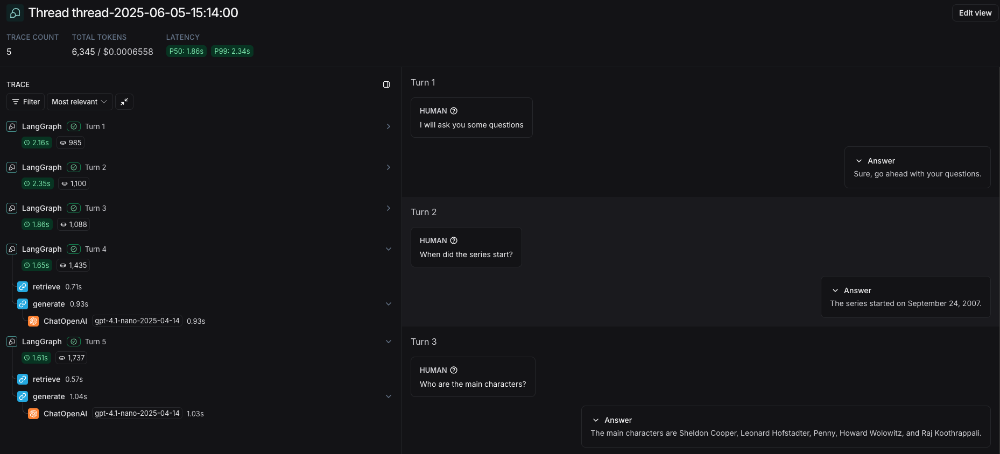

# Retrieval Augmented Generation Application

RAG-App is a lightweight, Streamlit-based web app that allows users to interact with OpenAI’s GPT models through a conversational UI. It leverages **LangChain** for structured prompt handling, **LangGraph** for message state management with memory, and **LangSmith** for LLM trace logging.  
The RAG Chatbot retrieves knowledge regarding the TV series "The Big Bang Theory" from a PDF document which contains the content and has been retrieved from the Wikipedia page of the series.  
The RAG chatbot trims the conversation history to reduce token usage (and cost), and logs each interaction with a dynamically generated thread ID for session traceability.

---

## Streamlit Demo

Below is a short video demonstrating the RAG chatbot in action within the Streamlit UI. Prompts can be entered, and the LLM will respond in real time, maintaining chat memory and formatting. The chatbot is designed to be user-friendly and efficient, providing concise responses and relevant information from the provided document, while also managing token usage effectively.



---

## Project Structure
```text
RAG-App
├─ README.md
├─ .gitignore
└─ rag_app
   ├─ config_example.json  # Example configuration file
   ├─ media
   │  ├─ RAG_Chatbot.gif   # Demo of the rag chatbot in action
   │  └─ RAG_Tracing.png   # Example LangSmith trace log
   ├─ rag_backend.py    # RAG backend for handling document retrieval and LLM interaction
   ├─ rag_ui.py    # Streamlit UI for the RAG chatbot
   ├─ requirements.txt   # Project dependencies
   └─ utils.py   # Utility functions for the RAG chatbot
```

---

## Installation
In a virtual environment, e.g. `conda`, with Python 3.13 the project dependencies can be installed as follows:
```bash
cd rag_app
pip install -r requirements.txt
```

---

## Running the RAG Chatbot App

### Config Setup
Before running the rag chatbot the configuration file needs to be set up with OpenAI and LangSmith API keys, the chat and embedding models, and the path to the document that will be used for knowledge retrieval.  
The provided template config file `rag_app/config_example.json` should be copied to `rag_app/config.json` and edited with the API keys, model names, etc.

```json
{
  "OPENAI_API_KEY": "the-openai-api-key",
  "LANGCHAIN_TRACING_V2": "true",
  "LANGCHAIN_API_KEY": "the-langsmith-api-key",
  "LANGCHAIN_PROJECT": "the-langsmith-project-name",
  "CHAT_MODEL": "gpt-4.1-nano-2025-04-14",
  "EMBEDDING_MODEL": "text-embedding-3-small",
  "DOCS_PATH": "path/to/docs/text.pdf"
}
```

Regarding the configuration options:
- `OPENAI_API_KEY`: The OpenAI API key can be generated from the OpenAI API platform.
- `LANGCHAIN_TRACING_V2`: Set to `true` to enable LangSmith tracing. If set to `false`, LangSmith tracing will be disabled.
- `LANGCHAIN_API_KEY`: The LangSmith API key can be generated from the LangSmith platform. If LangSmith tracing is disabled, this key can be omitted.
- `LANGCHAIN_PROJECT`: The name of the LangSmith project where traces will be logged. If LangSmith tracing is disabled, this can be omitted.
- `CHAT_MODEL`: The OpenAI model to be used for the chatbot. If preferred, another model can be used, e.g. `gpt-4.1-2025-04-14`.
- `EMBEDDING_MODEL`: The OpenAI model to be used for embeddings. If preferred, another model can be used, e.g. `text-embedding-3-large`.
- `DOCS_PATH`: The path to the document that will be used for knowledge retrieval. This should point to a PDF file containing the relevant information. For example, `rag_app/data/text_data.pdf`.

### Running the App
The Streamlit server can be started by running the following command in the terminal from the `rag_app` directory:
```bash
streamlit run rag_ui.py
```
A browser window should open automatically. If it does not, the app can be accessed by navigating to the following URL in a web browser:
```
http://localhost:8501
```

#### How It Works
- Uses OpenAI GPT models for conversational AI and for knowledge retrieval from the provided context
- Uses OpenAI embeddings for semantic search over the document
- Uses FAISS for efficient vector storage and retrieval
- Uses FAISS Flat index with an L2 distance metric for similarity search
- `LangChain` is used for structured prompt handling
- `LangGraph` is used to manage conversation state and memory
- `LangSmith` is used for LLM trace logging, enabling session tracking and debugging. Each session is logged with a unique dynamic thread ID for trace filtering.
- `Streamlit` is used for the web UI, allowing users to interact with the rag chatbot in a conversational manner

---

## LangSmith Logs Example

Below is an example of LangSmith trace logs. The traces include the full conversation history, the input and output of each graph node, token usage, and model call duration.


